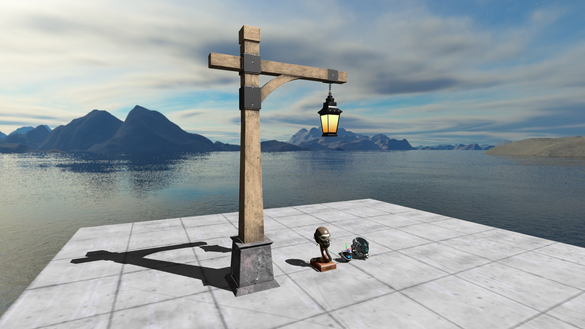

# rend3


[](https://crates.io/crates/rend3)
[](https://docs.rs/rend3)




Easy to use, customizable, efficient 3D renderer library built on wgpu.

Library is currently under heavy development and the api will rapidly change
as things are factored. While it's still in development, rend3 is able to be
used to build programs.

Rend3 is not currently release on crates.io, to use it add the following
to your Cargo.toml:

```
rend3 = { version = "0.0.1", git = "https://github.com/BVE-Reborn/rend3.git" }
```

## Examples

Take a look at the [examples] for examples on how to use the api.

[examples]: https://github.com/BVE-Reborn/rend3/tree/trunk/examples

## Purpose

`rend3` tries to fulfill the following usecases:
 1. Games and visualizations that need a customizable and efficient renderer.
 2. Small projects that just want to put objects on screen, but want lighting and effects.
 3. A small cog in a big machine: a renderer doesn't interfere with the rest of the program.

`rend3` is not:
 1. A renderer for AAA games. AAA games have requirements far beyond any possible indie game and would be unreasonable to target.
 2. A framework or engine. It does not include all the parts needed to make an advanced game or simulation nor care how you structure
    your program. I do have plans for a `rend3-util` (or similar) crate that is a very basic framework for the second use case listed above.

## Future Plans

I have grand plans for this library. An overview can be found in the issue tracker
under the [enhancement] label.

[enhancement]: https://github.com/BVE-Reborn/rend3/labels/enhancement

License: MIT OR Apache-2.0 OR Zlib
